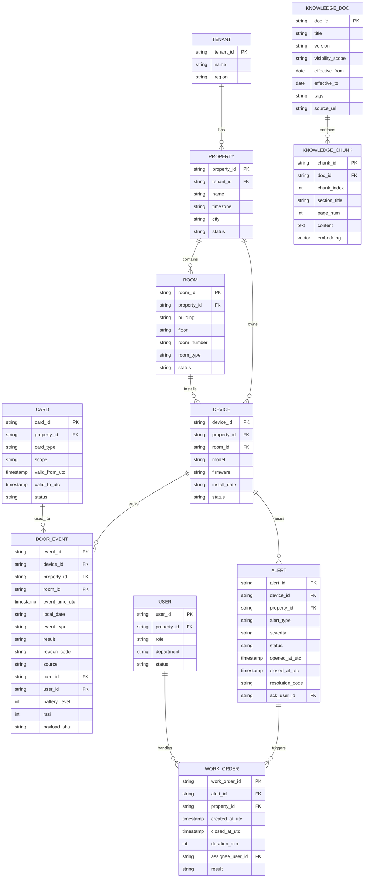

# 数据模型与口径约定（v1.0）

日期：2025-11-13

## 1. 设计原则
- 时区就近：所有存储采用 UTC，查询/展示按酒店所属时区转换。
- PII 最小化：不存储住客姓名/证件；涉及客史仅保留非识别性字段或哈希。
- 可追溯：关键事件与导出操作具备审计链路与最小必要字段。
- 一致口径：指标计算在数据服务统一实现，面向应用只暴露聚合结果。

## 2. 实体关系（ERD）

## 3. 字段与约束（要点）
- 通用：`*_id` 为字符串（雪花/UUID）；`*_utc` 为 UTC 时间戳；`local_date` 按门店时区的日期（YYYY-MM-DD），便于分区与对账。
- DOOR_EVENT：
  - `event_type` ∈ { open_attempt, open, close, fail, timeout, tamper, low_battery, alarm, manual_override }
  - `result` ∈ { success, fail, n/a }（非尝试类事件用 n/a）。
  - `reason_code` 约定枚举：invalid_card、expired_card、no_response、mechanical_block、low_battery_block、unknown。
  - `source` ∈ { card, mobile, staff, system }。
  - 索引：(`property_id`,`local_date`), (`device_id`,`event_time_utc`), (`event_type`,`result`).
- ALERT：
  - `alert_type` ∈ { low_battery, door_ajar, tamper, offline, comm_error }；`severity` ∈ { info, warn, critical }。
  - 索引：(`property_id`,`status`), (`device_id`,`opened_at_utc`).
- CARD：不落住客姓名；`card_type` ∈ { guest, staff, service, master }。
- USER：面向员工/系统账号；与租户/门店绑定；不落敏感个人信息。

## 4. PII 与合规
- 不存：住客姓名、证件、手机号、房号+入住人绑定关系等。
- 可存：`card_type`、匿名化 `user_id`（员工工号或系统账号即可）。
- 审计：对话问题做脱敏摘要；导出操作记录操作人、时间、范围与数据量级。
- 留存：事件与审计 90 天（默认）；知识库长期；具体按合同与法律要求可配置。

## 5. 时区与日界
- 存储统一 UTC；查询根据 `property.timezone` 转换。
- 跨日界/夏令时：按 IANA TZ 规则计算 `local_date` 与分组；避免以 24h 固定偏移。

## 6. 数据质量
- 反压与丢失：事件接入使用幂等（`event_id` + `payload_sha`）；缺失字段填充策略与告警。
- 口径锁定：聚合指标由数据服务统一计算，前端不复算。

## 7. 示例分区与表建议
- 事件明细：按 `local_date` 分区；冷热分层（≤30 天热数据）。
- 告警与工单：按 `opened_at_utc` 月分区。
- 衍生宽表：按报表需要构建（如设备日指标快照）。
